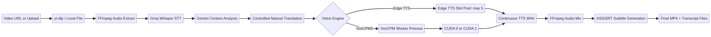
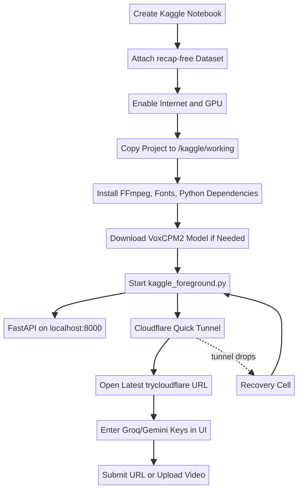

# Recap Free — AI Video Dubbing & Subtitling Studio

<p align="center">
  
</p>

<p align="center">
  <a href="https://www.python.org/">Python</a> ·
  <a href="https://fastapi.tiangolo.com/">FastAPI</a> ·
  <a href="https://www.ffmpeg.org/">FFmpeg</a> ·
  <a href="https://www.kaggle.com/docs/notebooks">Kaggle</a> ·
  <a href="https://github.com/yt-dlp/yt-dlp">yt-dlp</a>
</p>

> **Recap Free** is an end-to-end video dubbing and subtitling studio. It accepts a video URL or local upload, creates a timestamped transcript, performs controlled context-aware translation, generates speech with Edge TTS or VoxCPM2, mixes the narration back into the video, and produces Burmese-friendly ASS/SRT subtitles.

## Language / ဘာသာ / 语言

- [မြန်မာ](#မြန်မာ)
- [English](#english)
- [中文](#中文)

---

# မြန်မာ

## Project အကြောင်း

Recap Free သည် video တစ်ပုဒ်ကို မြန်မာဘာသာဖြင့် ပြန်လည်အသံသွင်းခြင်း၊ ဘာသာပြန်ခြင်းနှင့် စာတန်းထိုးခြင်းတို့ကို pipeline တစ်ခုတည်းအဖြစ်လုပ်ပေးသည့် web application ဖြစ်သည်။ YouTube သို့မဟုတ် အခြား video URL တစ်ခုထည့်နိုင်သလို local video file ကိုလည်း upload လုပ်နိုင်သည်။ Application သည် video ကို download သို့မဟုတ် သိမ်းဆည်းပြီး အသံဖိုင်ထုတ်သည်။ ထို့နောက် Groq Whisper API ဖြင့် timestamp ပါသော transcript ထုတ်ပြီး Gemini API ဖြင့် မူရင်းအဓိပ္ပာယ်ကို ထိန်းထားသော သဘာဝကျသည့် ဘာသာပြန်စာသားကို ပြင်ဆင်သည်။

ဘာသာပြန်အဆင့်တွင် စာလုံးတိုင်းကို တိုက်ရိုက်ပြန်ခြင်းမဟုတ်ဘဲ context ကို ဖတ်ပြီး native-language phrasing ကို ရွေးသည်။ သို့သော် creative rewrite မဟုတ်ပါ။ မူရင်းတွင် မပါသော fact၊ အမြင်၊ ဟာသ၊ အလှဆင်စကား၊ အကြောင်းအရာအသစ်များကို မထည့်ရန် prompt နှင့် validation rule များသတ်မှတ်ထားသည်။ Segment count၊ segment ID နှင့် timestamp များကိုလည်း မူရင်း transcript နှင့် တိုက်စစ်သည်။

## ဘယ်လိုအလုပ်လုပ်သလဲ

<p align="center">
  
</p>

Pipeline သည် အောက်ပါ အဆင့် ၈ ဆင့်ဖြင့် လုပ်ဆောင်သည်။

1. **Downloading** — URL ဖြစ်ပါက yt-dlp ဖြင့် video ကို download လုပ်သည်။ Local upload ဖြစ်ပါက upload file ကိုသုံးသည်။ YouTube anti-bot ပြဿနာရှိလျှင် user-provided cookies option ကိုသုံးနိုင်သည်။
2. **Audio extraction** — FFmpeg ဖြင့် မူရင်း video ထဲမှ audio ကို ထုတ်ပြီး `original_audio.wav` အဖြစ် သိမ်းသည်။
3. **Transcription** — Groq Whisper API ဖြင့် transcript အပြည့်နှင့် segment တစ်ခုချင်း timestamp များကိုထုတ်သည်။ မူရင်း transcript ကို `transcript.json` နှင့် `transcript.txt` တွင် မပြောင်းဘဲ သိမ်းသည်။
4. **Context analysis and translation** — Gemini သည် transcript အပြည့်ကိုဖတ်ပြီး entertainment၊ educational၊ emotional story၊ news/documentary သို့မဟုတ် conversation အဖြစ် ခွဲခြားကာ ထို tone နှင့်ကိုက်ညီသည့် controlled natural translation ထုတ်သည်။
5. **TTS generation** — Edge TTS သို့မဟုတ် VoxCPM2 ဖြင့် segment များကိုအသံဖိုင်ပြောင်းသည်။ Segment များကို continuous narration အဖြစ် ပြန်ပေါင်းသည်။
6. **Audio mixing** — TTS audio နှင့် video ကို FFmpeg ဖြင့် ပေါင်းသည်။
7. **Subtitle rendering** — ASS နှင့် SRT subtitle များထုတ်သည်။ မြန်မာစာအတွက် Unicode normalization နှင့် Noto Sans Myanmar font resolution ကိုသုံးသည်။ Burn-in mode ဖြစ်ပါက subtitle ကို video ထဲသို့ FFmpeg ဖြင့် ထည့်သည်။
8. **Complete** — final MP4၊ SRT၊ ASS၊ transcript နှင့် processing metadata များကို UI မှ download လုပ်နိုင်သည်။

## ဘာသာပြန်အဓိပ္ပာယ်မပျက်အောင် ထိန်းထားပုံ

Recap Free ၏ translation layer သည် “ပိုစိတ်ဝင်စားအောင် ပြန်ရေး” သည့် creative writer မဟုတ်ဘဲ **controlled natural translation** အဖြစ်လုပ်ထားသည်။ Model ကို အောက်ပါ စည်းမျဉ်းများချမှတ်ထားသည်။

- မူရင်းအဓိပ္ပာယ်၊ ဖြစ်ရပ်အစီအစဉ်နှင့် speaker intent ကို မပြောင်းရ။
- မူရင်းတွင် မပါသော fact၊ ရှင်းလင်းချက်၊ အမြင်၊ ဟာသ သို့မဟုတ် dramatic wording မထည့်ရ။
- နာမည်၊ နံပါတ်၊ ရက်စွဲ၊ နေရာ၊ unit နှင့် technical term မပြောင်းရ။
- Segment မပေါင်းရ၊ မခွဲရ၊ မဖျက်ရ။
- `id`၊ `start` နှင့် `end` timestamp များကို အတိအကျ ထိန်းရ။
- သဘာဝကျအောင် ပြန်ဆိုရသော်လည်း information density ကို မူရင်းနှင့် နီးစပ်အောင်ထားရ။
- Translation result မမှန်ပါက segment count နှင့် timestamp validation ပြန်လုပ်ပြီး JSON structure ကိုသာ repair လုပ်ရ။

Subtitle display တွင် စာကြောင်းရှည်လျှင် line break လုပ်သည်။ အဲဒီ line break သည် display အတွက်သာဖြစ်ပြီး TTS အတွက်အသုံးပြုသော translated text ကို ဖြတ်တောက်ခြင်းမဟုတ်ပါ။

## Voice engine များ

### Edge TTS

Edge TTS သည် local GPU model မလိုသော network-based neural speech service ဖြစ်သည်။ Kaggle တွင် model အကြီးစား download မလုပ်ရသောကြောင့် စတင်စမ်းသပ်ရန် အလွယ်ဆုံး engine ဖြစ်သည်။ မြန်မာအသံများအတွက် `my-MM-NilarNeural` နှင့် `my-MM-ThihaNeural` ကို UI မှ ရွေးနိုင်သည်။

v9 scheduler တွင် Edge TTS job အများဆုံး **၅ ခု တစ်ပြိုင်တည်း** run ရန် slot pool ထားသည်။ လက်တွေ့ throughput သည် CPU၊ RAM၊ FFmpeg၊ network နှင့် Groq/Gemini rate limit များပေါ်မူတည်သည်။

### VoxCPM2

VoxCPM2 သည် local voice generation နှင့် voice cloning အတွက်သုံးနိုင်သော model ဖြစ်သည်။ Reference audio နှင့် reference text ပေးပါက voice style ကို အသုံးပြုရန် ကြိုးစားနိုင်သည်။ Kaggle တွင် model ကိုပထမဆုံး download လုပ်ပြီး local directory မှ load လုပ်နိုင်သည်။

v9 တွင် VoxCPM2 job တစ်ခုချင်းစီကို Python spawned process သီးခြားဖြင့် run ရန် ပြင်ထားသည်။ T4 နှစ်လုံးရှိပါက scheduler က `cuda:0` နှင့် `cuda:1` ကို ခွဲပေးရန် ကြိုးစားသည်။ VoxCPM2 model size နှင့် runtime memory သည် version အလိုက်ကွာနိုင်သောကြောင့် T4 15 GB တစ်လုံးစီတွင် model နှစ်လုံး load/generate အောင်မြင်ကြောင်း Kaggle session ထဲတွင် စမ်းပြီးမှ production workload သတ်မှတ်သင့်သည်။ OOM ဖြစ်လျှင် VoxCPM2 concurrency ကို ၁ သို့လျှော့ပါ။

## v9 Concurrent jobs

Job တင်လိုက်သည်နှင့် လွတ်နေသော engine slot ရှိပါက ချက်ချင်းစသည်။ Slot မလွတ်သေးပါက pending queue ထဲသို့ဝင်ပြီး slot လွတ်သည်နှင့် အလိုအလျောက်စသည်။ Job တင်ချိန်တွင် ရွေးထားသော voice engine ကို snapshot သိမ်းသောကြောင့် job စပြီးနောက် Settings တွင် engine ပြောင်းလဲသော်လည်း စတင်ပြီးသား job ၏ engine မပြောင်းပါ။

| Engine | v9 maximum concurrent jobs | Hardware note |
|---|---:|---|
| Edge TTS | 5 | GPU မလိုပါ။ CPU, RAM, network နှင့် API limit ကို စောင့်ကြည့်ပါ။ |
| VoxCPM2 | 2 | `cuda:0` နှင့် `cuda:1` ခွဲရန် ကြိုးစားသည်။ VRAM မလောက်ပါက ၁ သို့လျှော့ပါ။ |

## Kaggle အသုံးပြုနည်း

<p align="center">
  
</p>

Kaggle Notebook တွင် **Internet** ကိုဖွင့်ပါ။ VoxCPM2 သုံးမည်ဆိုလျှင် **GPU** ကိုလည်းဖွင့်ပါ။ Project ကို Kaggle Dataset ZIP အဖြစ် upload လုပ်ရန်မလိုပါ။ Kaggle Cell 1 သည် GitHub `main` branch ကို `git clone` ဖြင့် `/kaggle/working/recap-free` ထဲသို့ တိုက်ရိုက်ရယူသည်။

အပြည့်အစုံ cell များကို [`KAGGLE_CELLS_v9.txt`](KAGGLE_CELLS_v9.txt) တွင် ထည့်ထားသည်။ Run order သည် အောက်ပါအတိုင်းဖြစ်သည်။

```text
Cell 1 — GitHub clone
Cell 2 — FFmpeg, Myanmar fonts, and Python dependencies
Cell 3 — VoxCPM2 model download
Cell 4 — FastAPI and Cloudflare foreground tunnel
```

Cell 4 သည် foreground process အဖြစ် run နေမည်။ Output ထဲမှ **နောက်ဆုံးထွက်သော** `trycloudflare.com` URL ကို browser တွင်ဖွင့်ပါ။ API key များကို repository code ထဲမထည့်ဘဲ UI Settings မှာ session အတွင်းသာ ထည့်ပါ။

Cloudflare quick tunnel URL သေသွားပါက အဟောင်း URL သည် ပြန်မရနိုင်ပါ။ `KAGGLE_CELLS_v9.txt` ထဲရှိ **RECOVERY CELL** နှင့် **RECOVERY CELL 2** ကို run ပြီး `CURRENT PUBLIC URL` အောက်မှ နောက်ဆုံး URL ကိုသုံးပါ။ Launcher သည် tunnel process ရပ်သွားပါက ပြန်စရန် supervisor loop ပါသည်။

## Local အသုံးပြုနည်း

Python 3.10 သို့မဟုတ် အထက်နှင့် FFmpeg လိုအပ်သည်။

```bash
git clone https://github.com/surviveman78-commits/recap-free.git
cd recap-free
python -m venv .venv
source .venv/bin/activate          # Windows: .venv\\Scripts\\activate
pip install -r requirements.txt
python run.py
```

Browser တွင် `http://127.0.0.1:8000` ကိုဖွင့်ပါ။ Local mode တွင် default launcher သည် browser ကိုဖွင့်နိုင်သည်။ Kaggle mode တွင် browser auto-launch မလုပ်ဘဲ `kaggle_foreground.py` ကိုသုံးပါ။

## API key နှင့် privacy

Groq နှင့် Gemini API key များကို code၊ README၊ notebook source သို့မဟုတ် Git commit ထဲ မထည့်ရ။ UI Settings မှာ session အတွင်းထည့်ပြီး application configuration ထဲတွင် local runtime အတွက် အသုံးပြုသည်။ Public repository သို့ key များ commit မလုပ်ရန် `.gitignore` ကိုလိုက်နာပါ။ Kaggle session ပြီးဆုံးသည့်အခါ output နှင့် runtime config များကို session ephemeral storage အဖြစ်ယူဆပါ။

YouTube cookies အသုံးပြုမည်ဆိုလျှင် ကိုယ်ပိုင် cookie file ကိုသာအသုံးပြုပြီး GitHub သို့မဟုတ် Kaggle Dataset ထဲ မတင်ပါနှင့်။ Video များကို download လုပ်ခြင်းနှင့် ပြန်လည်အသုံးပြုခြင်းတွင် မူပိုင်ခွင့်နှင့် platform terms များကို အသုံးပြုသူက စစ်ဆေးရမည်။

## Output files

Job တစ်ခုအတွက် output directory တွင် အောက်ပါဖိုင်များကို တွေ့နိုင်သည်။

| File | အကြောင်းအရာ |
|---|---|
| `transcript.json` | Groq မှရသော မူရင်း timed transcript |
| `transcript.txt` | လူဖတ်ရန် မူရင်း transcript |
| `processed_transcript.json` | Gemini ဘာသာပြန်ပြီး validation ဖြတ်ထားသော segments |
| `processed_transcript.txt` | လူဖတ်ရန် ဘာသာပြန် transcript |
| `translation_analysis.json` | Content type၊ tone နှင့် glossary metadata |
| `tts_audio.wav` | Continuous narration audio |
| `dubbed_video.mp4` | Audio mix ပြီးသော video |
| `subtitles.ass` | Styled subtitle file |
| `subtitles.srt` | Portable subtitle file |
| `final_video.mp4` | Final rendered video |

## Troubleshooting

### `ERR_NAME_NOT_RESOLVED` သို့မဟုတ် “This site can’t be reached”

Quick tunnel သည် temporary URL ဖြစ်သောကြောင့် process သေသွားလျှင် URL သေသွားသည်။ အဟောင်း URL ကို ပြန်ဖွင့်မည့်အစား TXT ထဲမှ recovery cells ကို run ပြီး နောက်ဆုံး public URL အသစ်ကိုသုံးပါ။ Cell 4 ကို interrupt မလုပ်ပါနှင့်။

### YouTube anti-bot error

Cloud notebook IP များကို YouTube က verification တောင်းနိုင်သည်။ yt-dlp version ကို update လုပ်ပါ။ လိုအပ်ပါက ကိုယ်ပိုင် browser session မှ export လုပ်ထားသော cookies file ကို UI/Notebook runtime တွင် ယာယီသုံးပါ။ Cookies file ကို repository ထဲ မထည့်ပါနှင့်။ မဖြစ်ပါက local video upload mode ကိုသုံးပါ။

### Burmese font မမှန်ခြင်း

Kaggle Cell 2 တွင် `fonts-noto-core`၊ `fonts-sil-padauk` နှင့် `fontconfig` install လုပ်ပြီး `fc-cache -f` run ထားရမည်။ UI တွင် `Noto Sans Myanmar` သို့မဟုတ် `Padauk` ရွေးပါ။ `subtitles.ass` တွင် selected font family၊ `subtitles.srt` တွင် normalized Unicode စာသားရှိ/မရှိ စစ်ပါ။

### VoxCPM2 CUDA out-of-memory

T4 တစ်လုံးစီတွင် model နှစ်လုံး load မဝင်ပါက concurrent VoxCPM2 jobs ကို ၁ သို့လျှော့ပါ။ Edge TTS ကိုသုံးလျှင် local VoxCPM2 model မလိုသောကြောင့် RAM/VRAM pressure လျော့နိုင်သည်။

### Progress မရွေ့ခြင်း

Frontend တွင် SSE stream နှင့် REST polling fallback နှစ်ခုလုံးရှိသည်။ Cloudflare buffering ကြောင့် SSE event မလာလျှင် polling သည် job status ကို update လုပ်ရန်ကြိုးစားသည်။ Browser refresh မလုပ်မီ job endpoint ကိုစစ်ပါ။ Tunnel ပျက်နေပါက recovery cells ကို run ပါ။

## Development notes

The application is intentionally divided into a FastAPI API layer, a queue/scheduler layer, and pipeline modules. Each job receives its own directory under the data directory so that transcript files, TTS snippets, subtitles, and rendered videos do not collide. Pipeline events are broadcast to the frontend through the job event stream, while the job state remains queryable through the REST status endpoint.

The v9 scheduler separates Edge TTS and VoxCPM2 capacity because their resource profiles are different. It does not assume that two T4 GPUs automatically guarantee two successful VoxCPM2 generations. The actual safe limit must be confirmed in the target Kaggle runtime by observing model load, generation, VRAM usage, and error logs.

## Project structure

```text
recap-free/
├── app/
│   ├── main.py                    # FastAPI routes and SSE status stream
│   ├── config.py                  # Runtime configuration and settings
│   ├── queue_manager.py           # v9 engine-aware scheduler
│   └── pipeline/
│       ├── downloader.py          # URL download and local upload handling
│       ├── groq_transcriber.py    # Cloud transcription
│       ├── gemini_rewriter.py     # Controlled translation and validation
│       ├── tts_engine.py          # Edge TTS and process-isolated VoxCPM2
│       ├── audio_mixer.py          # Audio/video mixing
│       └── subtitle_burner.py      # ASS/SRT and Burmese font rendering
├── static/                        # Web UI
├── config/                        # Example settings only
├── docs/                          # README diagrams
├── kaggle_foreground.py           # Server + self-restarting tunnel supervisor
├── KAGGLE_CELLS_v9.txt            # Kaggle cells and tunnel recovery cells
├── RECAP_FREE_Kaggle.ipynb        # Notebook template
├── requirements.txt               # Base dependencies
└── requirements-kaggle.txt        # Kaggle dependencies
```

## Current scope and limitations

The current implementation uses **Groq API for transcription** and **Gemini API for translation/controlled rewriting**. Local Whisper and local translation models are not included in this version. Edge TTS uses a network service. VoxCPM2 is the local voice-generation option and requires its model weights, compatible Python dependencies, and enough VRAM.

The project is intended for controlled personal and development use. It does not bypass access controls, guarantee that every platform URL is downloadable, or guarantee that a free notebook session remains alive for a particular duration. Always test one short video before submitting a larger batch.

---

# English

## Project overview

Recap Free is a web application for automated video dubbing, translation, and subtitle production. It accepts either a video URL or a local upload. The pipeline downloads or stages the source video, extracts its audio, requests a timestamped transcript from Groq Whisper, performs a conservative context-aware translation with Gemini, synthesizes narration with Edge TTS or VoxCPM2, mixes the generated audio into the source video, and renders ASS/SRT subtitles for the final output.

The translation layer is deliberately conservative. It is not a creative rewrite engine. The model first classifies the content so that it can choose a suitable tone, but it must preserve facts, order, speaker intent, names, numbers, dates, places, technical terms, and segment timestamps. The application validates the returned segment structure and keeps the original transcript separate from the processed transcript.

## Processing architecture

The architecture diagram above shows the complete flow from URL/upload to final MP4. The major boundary is between cloud language services and local media processing. Groq and Gemini process speech/text through API calls. FFmpeg, subtitle rendering, file isolation, and job scheduling run inside the local or Kaggle runtime.

The eight visible stages are downloading, audio extraction, transcription, context-aware translation, TTS generation, audio mixing, subtitle rendering, and completion. Every job has an isolated working directory and publishes progress events to the web UI. A REST polling fallback remains available when a tunnel buffers Server-Sent Events.

## Controlled translation and QA

The Gemini prompt uses a controlled-natural policy. It permits natural phrasing for the target language, but it prohibits unsupported additions, omissions, summarization, exaggeration, and creative embellishment. It also requires the same number of segments and the same `id`, `start`, and `end` values. If the response does not satisfy the structural contract, the application attempts a format repair and fails visibly if validation still does not pass.

Subtitle line wrapping is applied only to the rendered subtitle representation. It does not truncate the translated text used for speech synthesis. Unicode NFC normalization is applied before subtitle rendering so that Burmese combining marks are represented consistently.

## Engines and concurrency

Edge TTS is the recommended first Kaggle test because it does not require a large local voice model. The v9 scheduler allows up to five Edge TTS jobs at the same time. The actual rate is constrained by CPU, memory, disk, network, FFmpeg, and external API limits.

VoxCPM2 is the local voice-generation and cloning option. v9 assigns up to two VoxCPM2 jobs to separate spawned processes and attempts to place them on `cuda:0` and `cuda:1`. Process isolation is used because a thread pool alone may still serialize or conflict inside CUDA inference. A T4 pair should still be benchmarked in the target Kaggle session; if the model does not fit or generation fails, set the safe VoxCPM2 concurrency to one.

## Kaggle workflow

The repository includes [`KAGGLE_CELLS_v9.txt`](KAGGLE_CELLS_v9.txt). Cell 1 clones the latest GitHub `main` branch. The remaining cells install dependencies, install Myanmar fonts, download the optional VoxCPM2 model, start the server/tunnel, and recover dead quick-tunnel URLs.

Enable Internet in Kaggle. Enable a GPU when using VoxCPM2. Run the cells in order. Cell 1 clones the repository, so it must run with Internet enabled. Keep the foreground launcher cell running. Open only the latest `trycloudflare.com` URL printed by the supervisor. If the URL becomes unreachable, run the recovery cell, then use the latest URL printed by the recovery log reader.

API keys are entered in the UI for the active session. Do not place them in this repository, notebook source, or a Kaggle Dataset. Download completed outputs before the Kaggle session expires.

## Local workflow

```bash
git clone https://github.com/surviveman78-commits/recap-free.git
cd recap-free
python -m venv .venv
source .venv/bin/activate          # Windows: .venv\\Scripts\\activate
pip install -r requirements.txt
python run.py
```

Open `http://127.0.0.1:8000`, enter the Groq and Gemini keys in Settings, choose a voice engine, and submit a URL or local video. The Kaggle launcher is separate because it must not open a local browser and must keep the public tunnel alive.

## Security and operational notes

API keys, cookies, and user-provided reference voices are runtime data. They must not be committed. The application is designed to keep keys in the session settings layer rather than embedding them in source code. You remain responsible for the legal right to download, translate, dub, and redistribute any source video.

## Troubleshooting

A `trycloudflare.com` hostname is temporary. If its DNS record disappears, the old URL cannot be repaired. Restart the supervisor with the recovery cells and use the new URL. For YouTube anti-bot failures, update yt-dlp, use permitted cookies temporarily, or upload the source video directly. For Burmese glyph problems, install the Noto Sans Myanmar and Padauk packages, rebuild the font cache, and select a Burmese font in Settings. For VoxCPM2 CUDA out-of-memory, reduce its concurrent limit to one or use Edge TTS.

---

# 中文

## 项目简介

Recap Free 是一个用于视频配音、翻译和字幕制作的 Web 应用。用户可以输入视频链接，也可以上传本地视频。系统首先下载或准备源视频，然后使用 FFmpeg 提取音频，再通过 Groq Whisper API 生成带时间戳的转写结果。Gemini API 会读取完整转写内容，判断视频的内容类型和语气，并生成受约束的自然翻译。之后系统使用 Edge TTS 或 VoxCPM2 生成旁白，把旁白与原视频混合，并输出 ASS、SRT 和最终 MP4 文件。

这个项目的翻译层不是自由改写器。它允许目标语言表达自然，但不允许添加源文本中没有的事实、意见、笑话或戏剧化内容。姓名、数字、日期、地点、技术术语、事件顺序以及每个字幕片段的时间戳都应该保持不变。原始转写和处理后的转写分别保存，方便比较和审查。

## 工作流程

系统包含八个主要阶段：下载视频、提取音频、转写、上下文分析与翻译、语音合成、音频混合、字幕渲染和完成输出。每个任务都有独立的工作目录，因此多个任务不会共享同一组中间文件。前端通过事件流显示进度，并在网络隧道缓冲事件时使用 REST 轮询作为备用方式。

<p align="center">
  
</p>

Gemini 会先把内容归类为娱乐、知识教育、情感故事、新闻纪录片或普通对话。这个分类只用于选择合适的表达语气，不允许改变源内容。返回结果必须保持原有片段数量，并保留每个片段的 `id`、`start` 和 `end`。如果结构验证失败，系统会尝试修复 JSON；如果仍然失败，任务会明确显示错误，而不是静默地产生错误字幕。

## 语音引擎与并发任务

Edge TTS 不需要在 Kaggle GPU 上加载大型本地模型，因此适合第一次测试。v9 调度器最多允许五个 Edge TTS 任务同时运行。实际速度会受到 CPU、内存、磁盘、网络、FFmpeg 以及 Groq/Gemini API 限制的影响。

VoxCPM2 用于本地语音生成和参考音色克隆。v9 会为 VoxCPM2 任务创建独立的 Python 进程，并尝试把两个任务分别放到 `cuda:0` 和 `cuda:1`。这样做是为了避免仅使用线程池时出现 CUDA 推理串行或模型状态冲突的问题。由于 VoxCPM2 的显存需求会随版本和设置变化，必须在目标 Kaggle 会话中实际加载并生成测试。若出现显存不足，应把 VoxCPM2 并发数降为一，或者改用 Edge TTS。

## Kaggle 使用方法

仓库中的 [`KAGGLE_CELLS_v9.txt`](KAGGLE_CELLS_v9.txt) 包含完整的 Kaggle 单元格。第一个单元格会直接克隆 GitHub `main` 分支，后续单元格负责依赖安装、缅甸字体安装、VoxCPM2 模型下载、服务器和 Cloudflare 隧道启动，以及隧道失效后的恢复。

在 Kaggle 中打开 Internet。使用 VoxCPM2 时打开 GPU。按顺序运行单元格，因为第一个单元格需要从 GitHub 克隆项目。保持前台启动单元格继续运行。浏览器中只打开 supervisor 最新打印的 `trycloudflare.com` 地址。如果出现 DNS 错误或页面无法访问，请运行 recovery cell，然后使用日志读取单元格打印的最新地址。Groq 和 Gemini 密钥只在运行时通过 UI Settings 输入，不要写入仓库或 Kaggle Dataset。

## 本地运行

```bash
git clone https://github.com/surviveman78-commits/recap-free.git
cd recap-free
python -m venv .venv
source .venv/bin/activate          # Windows: .venv\\Scripts\\activate
pip install -r requirements.txt
python run.py
```

打开 `http://127.0.0.1:8000`，在 Settings 中输入 Groq 和 Gemini API 密钥，选择语音引擎，然后提交视频链接或本地文件。Kaggle 使用单独的前台启动器，因为 Kaggle 不应该自动打开本地浏览器，而且 Cloudflare 快速隧道必须保持运行。

## 隐私、版权和故障处理

API 密钥、cookies 和参考音频都属于运行时数据，不应提交到 GitHub。用户需要自行确认其有权下载、翻译、配音和重新发布源视频。Cloudflare quick tunnel 使用临时域名；域名失效时旧地址无法恢复，需要启动 supervisor 并使用新地址。YouTube 反机器人验证可以通过更新 yt-dlp、在允许的情况下临时使用 cookies，或直接上传本地视频来处理。缅甸文字形状异常时，请安装 Noto Sans Myanmar 或 Padauk，刷新字体缓存，并在 Settings 中选择缅甸字体。

---

## References

[1]: https://www.kaggle.com/docs/notebooks "Kaggle Notebooks documentation"

[2]: https://github.com/yt-dlp/yt-dlp "yt-dlp project documentation"

[3]: https://developers.cloudflare.com/cloudflare-one/networks/connectors/cloudflare-tunnel/do-more-with-tunnels/trycloudflare/ "Cloudflare Quick Tunnels documentation"

[4]: https://voxcpm.readthedocs.io/en/latest/quickstart.html "VoxCPM2 Quick Start documentation"

[5]: https://fastapi.tiangolo.com/ "FastAPI documentation"
